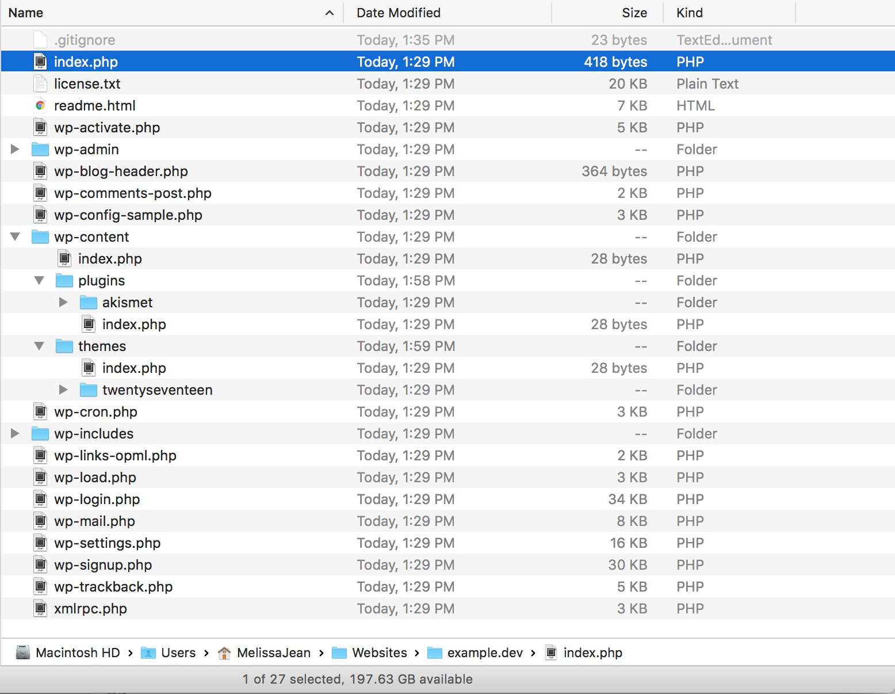
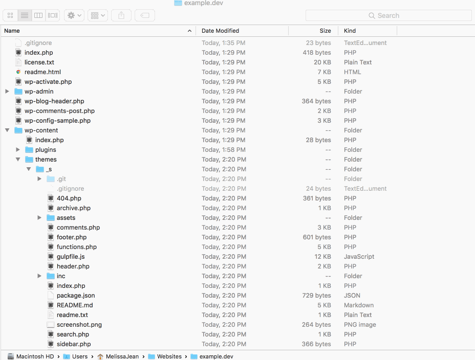
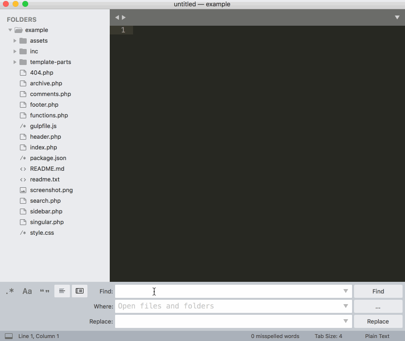
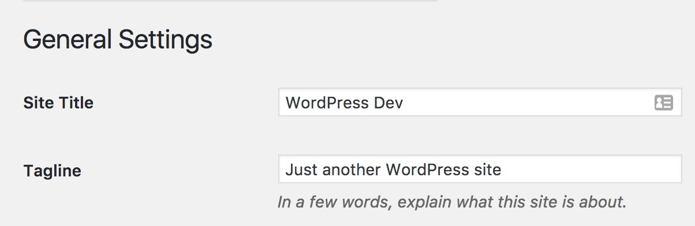

# Coding a custom WordPress theme

## Table of Contents

- [Set up the local WordPress site folder](#1-set-up-the-local-wordpress-site-folder)
- [Set up the local WordPress theme folder](#2-set-up-the-local-wordpress-theme-folder)
- [Rename the local WordPress theme](#3-rename-the-local-wordpress-theme)
    + [How to search and replace + tips for doing it](#how-to-search-and-replace--tips-for-doing-it)
    + [Performing the search and replace](#performing-the-search-and-replace)

------

### 1. Set up the local WordPress site folder

1. Download a fresh copy of WordPress.
    - If you have [WP-CLI](http://wp-cli.org/) installed, you can do this by typing `wp core download` in your terminal
    - Otherwise, go to [wordpress.org/download](https://wordpress.org/download/) to download the latest version.
1. Move the WordPress folder wherever you store your local websites.
    - For example, I have a folder named `Websites`, and within it, I have subfolders for each year
1. Rename the WordPress folder
    - Name it according to the client's domain. 
    - For example, if the client's site is `example.com`, your folder will be named `example.dev`
1. Delete `wp-content/plugins/hello.php`
1. Delete `wp-content/plugins/hello.php`
1. Delete `wp-content/themes/twentyfifteen`
1. Delete `wp-content/themes/twentysixteen`
1. Download the `.wp-gitignore` file [.wp-gitignore](assets/.wp-gitignore)
    - This `.gitignore` file is modelled after [WPEngine's recommendations](https://wpengine.com/git/).
    - It ignores all WordPress core files (`/wp-admin/`, and `wp-includes`, etc)
    - It ignores `node_modules`, and `.sql` files
1. Rename the `.wp-gitignore` file to `.gitignore`
1. Save the `.gitignore` at the root of the `example.dev` folder



### 2. Set up the local WordPress theme folder

1. Download the latest copy of [my fork of Underscores](https://github.com/melissajclark/_s)
    - Navigate to `example.dev/wp-content/themes/` in your terminal and type `git clone https://github.com/melissajclark/_s.git`
    - OR, download the .zip file from Github and place it in `example.dev/wp-content/themes/`
1. In the `wp-content/themes/_s/` folder, delete the `.git` folder
1. In the `wp-content/themes/_s/` folder, delete the `.gitignore` file 
    - If you don't see the `.git` and `.gitignore` files, you may need to enable seeing invisible files.
    - Follow these instructions to view hidden files on your Mac: https://ianlunn.co.uk/articles/quickly-showhide-hidden-files-mac-os-x-mavericks/
1. Delete the `wp-content/themes/_s/readme.md` file
1. Delete the `wp-content/themes/_s/readme.txt` file
1. Delete the `wp-content/themes/_s/assets/images/logo.svg` file
2. Add the client's logo in `wp-content/themes/_s/assets/images/` and name it `logo.svg`
    - This logo will be used for the WP Admin login screen.
    - See the `wp-content/themes/_s/assets/sass/login-style.scss` file for more details

### 3. Rename the local WordPress theme

#### How to search and replace + tips for doing it

- Press `Command` + `Shift` + `F` in Sublime Text to bring up the _Search in Folder_ panel
    - Enter `-*.txt,-*.md` in the _Where:_ field to exclude markdown and .text files 
    - First, press _Find_ to review what it finds
    - Next, press _Replace_ to replace all instances of your search term
- How to quickly perform the search and replace:
    - Press `Command` + `S` to quickly save and bypass the Save / Exit messages that come up
    - Press `Command` + `W` to quickly close files you do not want to change

#### Performing the search and replace

1. In your finder, rename the `_s` folder to `example`
2. Open the whole `example` folder in your text editor (I use Sublime Text)
1. Search for `'_s'` and include the single quotations to capture the theme's text domain. 
    - Replace with `'example'`.
2. Search for `_s_` to capture all the function names. 
    - Replace with `example_`.
3. Search for `Text Domain: _s` in style.css
    - Replace with `'Text Domain: example`.
    - FYI 1: the text domain must match the theme's folder name. This is why we already renamed the folder to `example`.
    - FYI 2: the text domain is used across all functions on the website.
4. Search for <code>&nbsp;_s</code> (with a space before it) to capture DocBlocks. 
    - Replace with <code>&nbsp;example</code>.
5. Search for `_s-` to capture prefixed handles. 
    - Replace with `example-`.
6. Search for `Theme URI: http://underscores.me/` to capture the theme's URL
    - Replace with `Theme URI: http://example.com` (the client or project's URL)
7. Search for `Description: Naked WordPress starter theme, via Automattic.` to capture the theme description
    - Replace with `Description: Custom WordPress theme developed for Example by Melissa Jean Clark`


_Renaming functions in the WordPress theme_

#### 4. Setting up your local server

For this step you can use MAMP / Vagrant / Local / etc, the tool does not matter. You just need a local environment that can run WordPress. 

1. Naming of database
2. WP-config settings
3. Etc

#### 5. Set up Gulp for the WordPress theme

The `gulpfile.js` and `package.json` follow Ahmed Awais' WPGulp set up. See his notes for more info on setting up: [WP Gulp](https://github.com/ahmadawais/WPGulp#-step-2-editing-the-project-variables).

1. In the `wp-content/themes/example/gulpfile.js` file:
    - Search for `wp.dev`
    - Replace with `example.dev` (or whatever your local site URL will be)
2. Type `npm install` or `sudo npm install` to install the Gulp dependencies for our theme
3. Once the dependancies download, type `gulp` to test it out

#### 6. Setting up a remote Bitbucket repository

1. Set up remote repo
2. Locally, add remotes
3. Push local work to remote repo

-----

### Whew! 

At this stage, your WordPress development environment is set up. All code will be stored in a private Bitbucket repository. 

The steps above may seem like a lot, but a lot of them are tiny things like renaming a folder, or deleting a file. The initial setup listed above takes me about fifteen minutes. 


### Setting up (WP admin)

1. Remove the "Just another WordPress site" from Settings > General 
2. Install WP development plugins
3. Create user account for client (use dummy email)
4. Create user account for me

### Set up WPEngine staging site

1. Enable git push WPEngine site
2. Add remote

#### About the starter theme

1. File structure

#### Best practices and strategies

1. All templates should be built to be as flexible / re-usable as possible. 


#### Security & Translation

- All strings should be formatted like this:
```
GOOD: <h1><?php esc_html_e('Events', 'example');?></h1>

BAD: <h1>Events</h1>
```
- The `_e` part of the function ensures the content is available for translation. 
- The `'example'` part of the function is the text domain (theme name)
- Learn more: [Codex: esc_html_e](https://codex.wordpress.org/Function_Reference/esc_html_e), [Codex: esc_html](https://codex.wordpress.org/Function_Reference/esc_html)
- 

#### Functions


#### ACF Best practices

1. All image fields should use the `id` return option.
2. All ACF functions should be wrapped in the ` if function_exists('get_field')` function
3. All field data should be stored in a variable
    - using the variable instead of `get_field('field_name')` every time reduces calls to the database and keeps code organized
    -  


