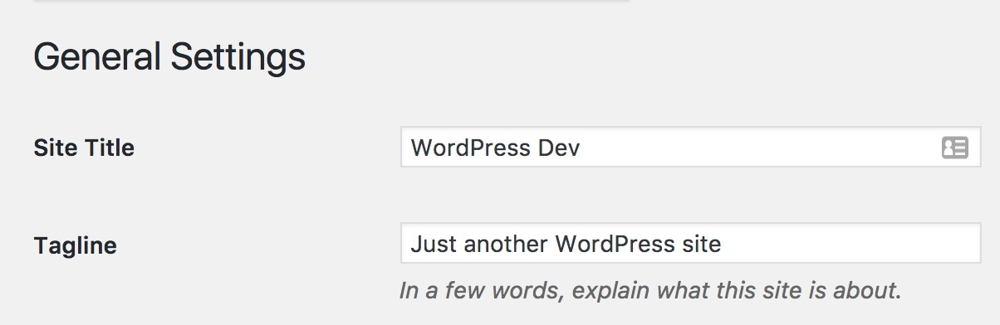

# Coding a custom WordPress theme

### Setting up (development)

1. Download a fresh copy of WordPress.
    - If you have [WP-CLI](http://wp-cli.org/) installed, you can do this by typing `wp core download` in your terminal
    - Otherwise, go to [wordpress.org/download](https://wordpress.org/download/) to download the latest version.
2. Navigate to the `wp-content` folder of your WordPress download
    - [ ] Delete `/plugins/hello.php`
    - [ ] Delete: `/themes/twentyfifteen`
    - [ ] Delete: `/themes/twentysixteen`

All custom themes start from my fork of [Underscores](https://github.com/melissajclark/_s).

### Setting up (WP admin)

1. Remove the "Just another WordPress site" from Settings > General 

### Functions

